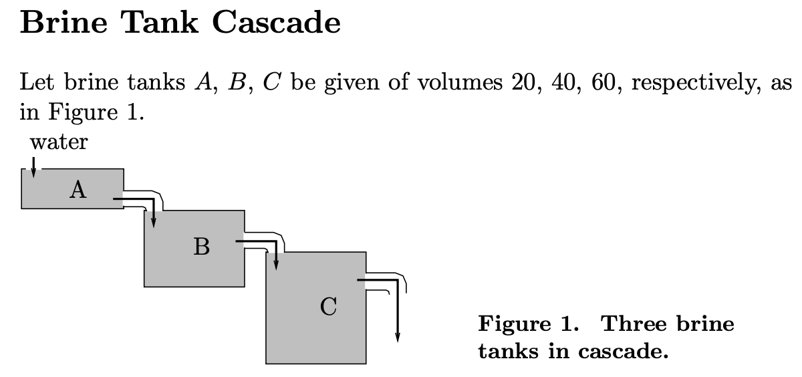

# equaPy
Tools for numerical analysis of Ordinary Differential Equations(ODE) in Python using sympy.

The goal of equaPy is to numerically solve your ODEs in an easy, compact and visually good looking way.


For this project I want to do as many thing as possible from scratch. I'm not using any python library to solve ODEs.
However I'm using sympy to read ODEs from string inputs and compute gradients.
This might be replaced by my own tools if I find the motivation to build them.
I also might not use sympy to compute gradients in the future since I plan on using GPU acceleration.

Most of the science behind the project is from a course I took at Sorbonne Université, Paris in my 3rd year. "Analyse Numérique".
You can email me if you are interested in the course's pdf. But please note that it is written in french.

## Table of contents
1. [What can you do with equaPy ?](README.md#what-can-you-do-with-equapy)
2. [How does it work ?](README.md#how-does-it-work)
3. [Example](README.md#example)
4. [TODO](README.md#todo)

# What can you do with equaPy ?
For now equaPy includes :
- Definition of ODEs
- Numerical methods:
    - Explicit Euler
    - Modified Euler (middle point)
    - Implicit Euler
    - Crank-Nicolson
    - Taylor
    - Runge Kutta

# How does it work ?
## The model
And ODE with initial values is usualy defined this way :


$$\begin{aligned}
&y^{(n)}(t)=f(t, y(t), y'(t),\ldots,y^{(n-1)}(t)) \\
&y(t_0)=y_0 \text{ } , \ldots, \text{ } y^{(n-1)}(t_0)=y^{n-1}_0 
\end{aligned}$$

where $y:I \rightarrow {\mathbb{R}}^m$ and $f:I\times ({\mathbb{R}}^m)^{n} \rightarrow \mathbb{R}^m$ and $I \subset \mathbb{R}$.

To solve this ODE for values of $n \geq 2$ what you usually do is find an equivalent equation with reduced order :

$$\begin{aligned}
&Y(t) = (y(t), y'(t), \ldots, y^{(n-1)}(t)) \\
&\frac{dY(t)}{dt}=F(t, Y(t))
\end{aligned}$$

where 

$$\begin{aligned}
F:&I\times (\mathbb{R}^m)^n \rightarrow (\mathbb{R}^m)^n \\
&(t, Y_1, Y_2, \ldots, Y_n) \mapsto (Y_2, \ldots, Y_n, f(t, Y_1, Y_2,\ldots,Y_n))
\end{aligned}$$

Then once $Y$ is solved, you get the solution of the first equation : $y=Y[0]$.

But this is not exactly how equaPy stores an ODE. Since there can be systems of ODEs, the `ODE` class is a bit more general.

## The `ODE` model
An ODE system can have many equations, not just one.

For example :

$$ (E) \left\lbrace
\begin{aligned}
&q'(t) = p(t), \\
&p'(t) = -\frac{q(t)}{||q(t)||^3}, \\
&q(0) = q_0, \\ 
&p(0) = p_0.
\end{aligned}
\right.$$

where $(q, p) \in \mathbb{R}^2 \times \mathbb{R}^2$.

How to fit this system to our model ? The idea : split every high-dimension equations into many 1-dimensions equations.

In our case, it would first become like this :

$$ (E') \left\lbrace
\begin{aligned}
&q_1'(t) = p_1(t), \\
&q_2'(t) = p_2(t), \\
&p_1'(t) = -\frac{q_1(t)}{\sqrt{q_1(t)^2+q_2(t)^2}^3}, \\
&p_2'(t) = -\frac{q_2(t)}{\sqrt{q_1(t)^2+q_2(t)^2}^3}, \\
&q_1(0) = q_{0, 1}, \\ 
&q_2(0) = q_{0, 2}, \\ 
&p_1(0) = p_{0, 1}, \\
&p_2(0) = p_{0, 2}.
\end{aligned}
\right.$$

Which can be written :

$$\left\lbrace
\begin{aligned}
y'(t)=& f(t, y_1(t), y_2(t), y_3(t), y_4(t)) \\
=&(y_3(t), y_4(t), -\frac{y_1(t)}{\sqrt{y_1(t)^2+y_2(t)^2}^3},-\frac{y_2(t)}{\sqrt{y_1(t)^2+y_2(t)^2}^3}) \\
y(0)=&(y_1(0),y_2(0),y_3(0),y_4(0)) \\
=&(q_{0, 1}, q_{0, 2}, p_{0, 1}, p_{0, 2})
\end{aligned}
\right.$$

The process is the same for higher orders, the equation would look like something like this : 

$y^{(n)}(t)=f(t, y_1(t), y_2(t), y_3(t), y_4(t), y'_1(t), y'_2(t), y'_3(t), y'_4(t), \ldots, y^{(n-1)}_1(t), y^{(n-1)}_2(t), y^{(n-1)}_3(t), y^{(n-1)}_4(t))$ 

The order can also be reduced, the same way we explained earlier.

Once your system of ODEs is split into 1-dimension equations, you can feed it to the `ODE` class and solve it.

When setting a 1-dimension equation of order $n$, you only give the expresion $f(...)$ of the equation $y^{(n)}(t)=f(...)$.
Then, if derivatives appear in the expression, you have to write in the format `"d<var><index>"`.

For example if i want to write $y''(t)=-y'(t) + 2*t$, you would have to give `"-dy1 + 2*t"` (assuming $y$ is 1-dimensional). See example for more details.

For higher order derivatives, juste add as many `d` before the variable's name.

More generally, an ODE system of dimension $m$ and order $n$ is written :

$$ (E) \left\lbrace
\begin{aligned}
&y_1^{(n)}(t)=f_1(t, y_1(t), \ldots, y_m(t), y'_1(t),\ldots, y'_m(t), \ldots, y^{(n-1)}_1(t), \ldots, y^{(n-1)}_m(t)) \\
&y_2^{(n)}(t)=f_2(t, y_1(t), \ldots, y_m(t), y'_1(t),\ldots, y'_m(t), \ldots, y^{(n-1)}_1(t), \ldots, y^{(n-1)}_m(t)) \\
&\ldots \\
&y_m^{(n)}(t)=f_m(t, y_1(t), \ldots, y_m(t), y'_1(t),\ldots, y'_m(t), \ldots, y^{(n-1)}_1(t), \ldots, y^{(n-1)}_m(t)) \\
&(y_1, y_2, \ldots ,y_m)
\end{aligned}
\right.$$

$$ (E) \left\lbrace
\begin{aligned}
&(y_1, y_2,\ldots,y_m)(t_0)=(y_{1,0},y_{2,0},\ldots,y_{m,0}) \\
&(y'_1, y'_2,\ldots,y'_m)(t_0)=(y'_{1,0},y'_{2,0},\ldots,y'_{m,0}) \\
&\ldots \\
&(y^{(n-1)}_1, y^{(n-1)}_2,\ldots,y^{(n-1)}_m)(t_0)=(y^{(n-1)}_{1,0},y^{(n-1)}_{2,0},\ldots,y^{(n-1)}_{m,0})
\end{aligned}
\right.$$

Then its reduced form is :

$$(E)\left\lbrace
\begin{aligned}
&Y(t)=(y_1(t), \ldots, y_m(t), y'_1(t),\ldots, y'_m(t), \ldots, y^{(n-1)}_1(t), \ldots, y^{(n-1)}_m(t)) \\
&\frac{dY(t)}{dt}=F(t, Y(t)) \\
&F(t, Y(t))=(y'_1(t), \ldots, y'_m(t), y''_1(t),\ldots, y''_m(t), \ldots, y^{(n-1)}_1(t), \ldots, y^{(n-1)}_m(t), f_1(t, Y(t)),\ldots,f_m(t,Y(t)))
\end{aligned}
\right.$$


## Example
### Brine tank cascade

Let's try to solve the ODE system for the brine tank cascade problem.

(source : University of Utah, Math Department)



And the equations are

$$\left\lbrace
\begin{aligned}
x'_1(t)=&-\frac{1}{2}x_1(t), \\
x'_2(t)=&\frac{1}{2}x_1-\frac{1}{4}x_2(t), \\
x'_3(t)=&\frac{1}{4}x_2-\frac{1}{6}x_3(t).
\end{aligned}
\right.$$

To solve it with equaPy :

```python
from lib.ode import ODE
from lib.ode_methods import ExplicitEuler

ode = ODE(3, 1, 0) # dim=3 1-dimension equations | order=1 | t0=0
ode.setinit([20, 40, 60])
ode.setsymbols("x") # arbitrary symbol
ode.setfunction(1, "-x1/2")
ode.setfunction(2, "x1/2 - x2/4")
ode.setfunction(3, "x2/4 - x3/6")

scheme = ExplicitEuler(ode) # choosing method
T, N = 50, 1000
time, values = scheme.solve(T, N)
print(values[:10])

>>> [[20.         40.         60.        ]
     [19.5        40.         60.        ]
     [19.0125     39.9875     60.        ]
     [18.5371875  39.96296875 59.99984375]
     [18.07375781 39.92686133 59.99938216]
     [17.62191387 39.87961951 59.99847308]
     [17.18136602 39.82167211 59.99698104]
     [16.75183187 39.75343536 59.9947771 ]
     [16.33303607 39.67531321 59.99173857]
     [15.92471017 39.5876977  59.98774883]]
```

### 

# TODO
- Save/load ODEs
- Save/load solutions data
- graphical tools
- For M1 and later macs : gpu acceleration using pyTorch
    


